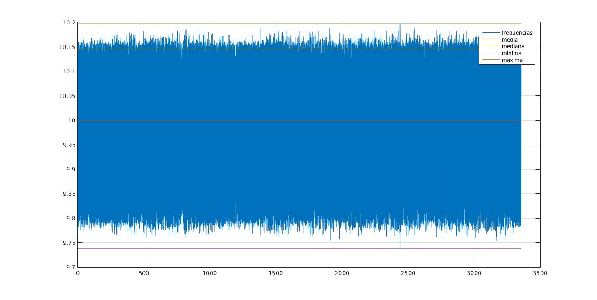

# Rastreamento Inercial
Desenvolvimento de um sistema de rastreamento inercial.

## Arquivos do repositório

* **Arduino**: *"Sketch"*  para serem enviados para o arduino.
    * **Host1Sensor**: Ainda em necessário monta-la, será utilizado para receber os dados de 1 board nRF24LE1 conectada aos sensores e, então, os enviar para o computador via Serial.
    * Leitor Sensores: Exemplo para leitura dos dados sensores. Não será usado no final.
    * Obtencao_de_pacotes: Obtem um pacote de leituras inerciais na sua forma com váriveis de 8 bytes cada. Para utilizado a biblioteca i2clib foi levemente alterada para que envie os pacotes na forma bruta.
    * **Redireciona Serial**: Sendo utilizado para redirecionar o que é recebido no serial1 para o serial0. Permitindo comunicação UART com o nRF24LE1.
* **Keil**: Projetos escritos, para o nRF24LE1. Projetos fora das pastas Testados e Não Testados estão sendo desenvolvidos.
    * Não Testados: Varios projetos antigos que não exclui. Quase inútil.
    * blink: Pisca os leds, foi testado e funciona bem.
    * btn_and_led: Ao se apertar um botão em um rádio é alterado o estado de um led em outro rádio.
    * Serial: Somente envia alguns 'Lorem ipsum' por comumicação UART.
    * Timer: Utilização de funções no Timer0. Existe um timer de 30Hz e um de 10Hz. Foi testado e existem gráficos do funcionamento.
        * Timer: Timer de 30Hz.
        * Timer_10_Hertz: Timer de 10HZ.
    * send_false_packet: Envia um pacote falso para um radio receptor, este recebe e encaminha para uma porta serial.

* **Python**: Um data-logger bem útil pra salvar algumas leituras se for preciso. Há, também, algumas leituras salvas e plotadas no matlab.

* **eagle**: Projeto no eagle para a confecção de uma PCB utilizando o CI MAX232.

## Resultado do teste do send false packet
Frequência de amostragem X amostras

